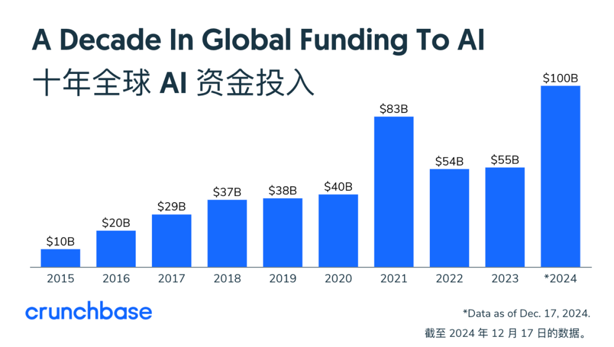
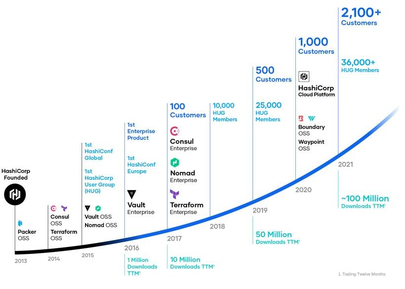
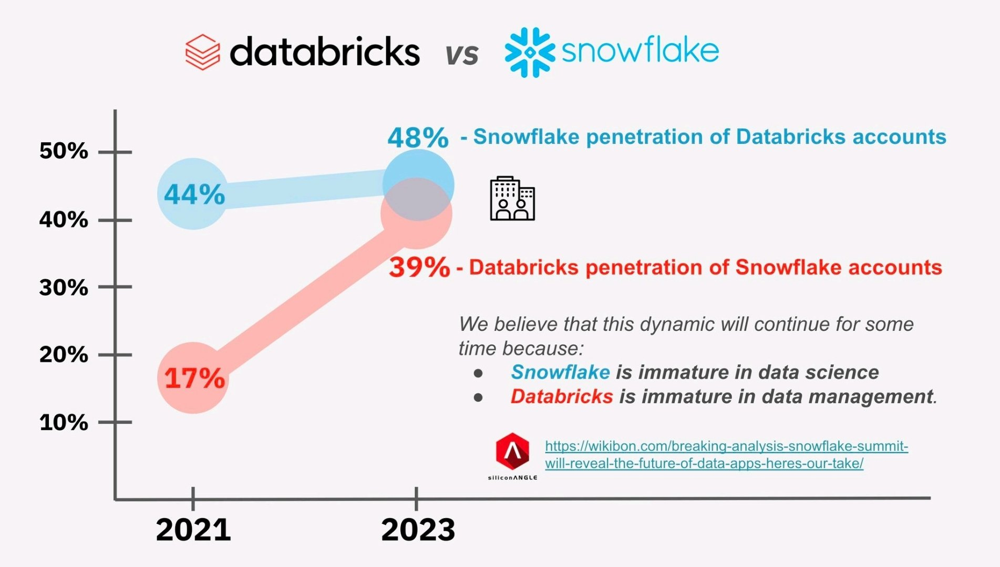
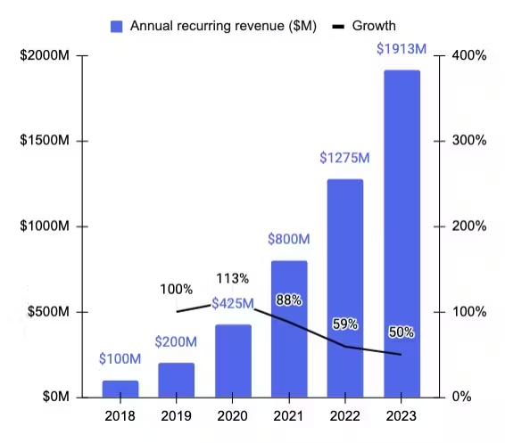

# 商业化篇

## 概述：

开源软件的商业化是指在开源软件的基础上，通过各种策略和模式，将其技术、服务等转化为可盈利的业务，从而实现经济价值和可持续发展。开源软件的商业化能力是软件及其生态可持续发展的重要动力，也是开源软件企业在发展过程中面临的最艰巨的挑战。

往期开源年报，商业化篇以综合研究报告形式呈现，由时任云启资本的投资人徐至行先生主笔撰写，内容翔实、客观全面、洞察深入，为中国开源产业的研究提供了重要的内容资料。

今年则以访谈的形式组织商业化篇的内容，内容访谈了四位专注于开源技术、基础软件、云服务的投融资专家，他们分别是**徐至行（国方创新）、刘景媛（德联资本）、丁宁（INP）和刘超（Atypical Ventures ）**。在于他们的访谈中，总结和分析过去几年开源软件领域内的发展和对未来资本市场的展望。同时他们也坦诚地分享了个人职业发展中对于该领域的认识与理解，以及对于开源企业商业化与增长的经验与看法。

## 《将开源作为工具，专注内功共渡寒冬》

### 访谈嘉宾： 徐至行（国方创新）

_在与徐至行的本次采访中，内容涵盖了基础设施、云服务、开源技术多个关键方面，包括投资趋势、软件开发的未来以及人工智能技术的应用与发展。还涉及了他理解的资本热度与经济周期的关系，以及当前商业环境对初创公司和风险投资带来的挑战。_

_另外在采访中，徐至行也强调了中美在软件商业化和用户付费习惯上的主要差异，但 AI 和开源软件为行业带来了寒冬中的希望。他强调，软件的未来可能超越传统商业模式，转向更智能化的服务和应用。尽管面临诸多挑战，徐至行依然对科技行业的未来持乐观态度，认为持续的创新和技术进步将是推动行业发展的关键动力。_

### 近期资本市场对于开源的投入趋于冷静，有哪些因素？未来是否积极？

当前资本与经济周期紧密相关。许多因素不仅影响商业创业本身，还与整体经济环境息息相关。例如，自 2008 年金融危机以来，中国国内的外贸状况及全球化进程也发生了显著变化。目前，整体商业环境状况不佳，企业普遍持谨慎态度，信贷环境已明显收紧。

尽管 AI 技术前景广阔，北美由于其对金融市场和经济状态的较好，情况会相对较好，且目前处于降息周期，拥有较为充足的创新资源。

相比之下，国内底层创新资源的注入较少，加之普遍的谨慎情绪，能够持续增长的领域有限，因此，从长远来看，推动创新确实面临相当大的挑战。

### 企业和创业团队应当如何寻求新的资源支持？

首先，在风险投资这一领域，我有一个深刻的体会，那就是中国的风险投资市场，特别是股权投资市场，正经历着一场巨大的变革。

这种变化甚至不是周期性的。因为某些金融模式在固定模式下是周期性的。我们分析了众多的商业模式，发现中国的一级市场也在发生显著变化。过去典型的做法是模仿或照搬硅谷的模式。风险投资，尤其是科技类风险投资，起源于硅谷。过去，我们沿袭这种商业模式，使用美元资金，甚至这些资金也来自美国，遵循美国的投资逻辑，然后持续这一过程。

然而，如今的情况与以往存在一些差异。首先，国内科技创新企业的发展周期已发生变化，与美国科技企业的发展周期不再同步。此外，中美关系的紧张态势甚至波及到了科技领域。今年年初的法案对美元投资的影响还较为严重，导致国内某些领域出现了资金短缺。然而，这并不意味着科技创新领域的投资需求有所减少，实际上，它仍在寻求新的支持方式，这一点大家都在探索中。

由于国内经济实力的增长，一些本土人民币属性的科技投资机构开始出现。这导致了投资方式的变化，从以前的美元投资转变为人民币投资。尽管人民币投资目前面临困难和挑战，但随着地方政府的支持逐渐增加，这一转变正在发生。这是一个探索性的过程，而国内的一级市场股权投资的未来形态正变得难以预测。如同一级市场上所讨论的“定投”现象，即投资者在退出时所获得的回报取决于他们的商业模式、所销售的产品以及原材料成本等因素。

国内二级市场和整个金融环境的变化又进一步影响了这一现象。因此，我认为这种变化在国内的早期科技领域中表现为寻求何种资金或能量的注入。

人民币基金似乎更倾向于以人民币为主，这也是一种探索。显然，这不再遵循过去美元投资的模式，而是需要寻找新的方法来优化整个流程，这是当前从业者面临的一项挑战。总体来说，一级市场的这些变化导致了资金的短缺，与前几年相比，情况已大不相同。

所以，那不靠风险投资靠什么，就变成了一个很好的问题，我觉得阶段性可能也还是要看实际商业周期里面的下游给你的用户。

**我认为中国的资本市场和早期科技投资领域将会有所变革。这需要我们共同探索。投资不仅仅是投资机构单方面的行为，而是需要与被投企业共同成长。我们需要一起探索适合中国国情的发展路径。**

因此，在这个时间节点上，大家的观点呈现出明显的分歧。例如，如果一个创业者今天的想法是专注于海外市场，即纯粹的出海策略，也是一种探索方式。但如果还想保留进入中国市场的可能性，而中国市场是一个庞大的市场，并且具有其独特的特点，**那么在中国市场的发展路径和投资端资源的配套问题，是我们需要共同探索的。**

### 就是说要尽可能提前做商业化的计划？

我觉得是要早点做商业化的，或者不用商业化来形容。以前叫PMF或者财务模型跑通。因为最近我和北美的小伙伴们也有交流，即便经济环境较好，大家也都很务实，毕竟也经历过互联网泡沫等。

现在看投项目主要分为两类。在美国，除了非常明星的创始人或者团队，其他大量项目是需要看实际的增长潜力的，就是看你实际运营一段时间的产品的数据是怎么样的。

北美商业环境比较好，是因为很多小公司是比较容易找到一些种子用户，YC 的很多项目往往运营了一小段时间，就有能力开始收费，这是一个基础。然后看未来的收入是否有放大的机会，并不是创始人仅凭一个梦想。

所以在国内也是一样，如果你在阶段性有少量的验证，那再去验证下一个步骤叫放量。需要团队还比较小时，有机会看到增长的趋势，发展过程中不再仅靠投资人的钱来维持，而是多方面助力。虽然融资可能使公司在初期在基金上有一定优势，但也要注意不能养成用户无需付费的习惯。之前的有种不好的氛围就是，早期有投资人养着你，所以用户认为自己可以免费白嫖所有资源，等平台成功了再付款，这也是对客户预期的错误影响。

在当前大环境不变的情况下，资源和资金都有其成本。我们需要考虑如何在这样的条件下做好。当然，未来也有可能带来变化。有趣的是，变化本身为我们提供了新的机会。

### 过去一年基础大模型之间，又以「免费」「价格战」的方式吸引开发者和客户，会否又给软件付费氛围带来了白嫖的暗示？

的确，这很典型。C 端有其独特的商业模式。许多企业服务软件面向的是B端市场，但在中国，以中小 B 端客户为主的核心市场中存在一个中间层，即所谓的「小B服务大C」的模式，或者专业开发者，面向专业用户。这一中间层的存在是市场变革的一个因素。例如，当服务靠近 C 端，它们可能面临“白嫖”现象，这不仅对服务提供者的生存构成挑战，也降低了他们的付费意愿。然而，当市场环境改善，这些服务提供者自身的盈利和经营状况好转时，他们便可能表现出付费意愿。

这一现象在中国与美国之间的市场差异中尤为明显。中美之间差异的核心在于软件付费结构的差异。在软件维度上，头部收入来自央企、国企，呈现出倒金字塔的结构，它们能够贡献的付费比例非常高。虽然中小机构数量较多，但它们对商业的贡献相对有限。

这种结构使得基础盘的稳定性只能依赖于头部企业的支持。这部分企业的特点在于，它们拥有较强的话语权，可能需要更多的服务比例，或者有定制化的需求，这都源于它们较强的话语权所导致的差异。而北美市场的付费结构可能并不完全是正金字塔形，但至少其腰部企业规模较大且稳定，从而具备较强的复利效应。

开源之所以存在，是因为它本质上还是软件。但我们今天讨论的不只是开源软件，而是国内软件生态所面临的挑战。为什么大家会觉得软件的毛利率高？这是因为，与制造业相比，软件理论上具有较高的复制性。一份代码或一份拷贝提供给所有人，不需要额外的成本。这就是毛利率高的原因，不需要重新成本。但这种可复制性主要存在于横向复制的场景中，而在那些头部企业之间，复制性会比较低。

本质上，真正属于软件生产成本的优势并没有那么显著。在北美那种正向金字塔模式下，中间层的状态会比较好。但国内的这个部分比较小，导致的情况就是稳定度不是很高，还是要改变用户习惯。国内还面临着市场化程度不高，理论上就是优胜劣汰，你不好了你就没了，你没了之后，但需求又还在。

### AI 方向是否存在更多机会？

首先是基础大模型，现在看来开源模型和闭源模型都值得一直关注。

往上一层，存在一个偏中间层，也被称为AI Infrastructure，或者位于模型之上、应用之下的层次。这一层是开发者参与度较高的典型层次。开源原本对开发者生态就非常有利，因此这一层的开源活动相对较多。

再往上就是开源的应用，即基于AI的应用。目前，在 AI 应用领域，虽然已经有一些开源项目，但不算多，还有待进一步发展。

基础软件领域中，类似于传统中间层的部分，尤其在区分国内和海外业务时，海外市场实际上相当活跃。这种热度源于一个简单的事实：在AI基础设施尚未盛行之前，北美地区就已经出现了一些商业化运作相对成功的案例。这些案例至少为业界提供了一条明确的发展路径和潜在的机会。这一层与以往的数据基础设施有些相似，但也有时会涉及到一些较为细分和垂直的领域。

**即便如此，至少要等到生态健全，才有可能行成成熟的产品体系。正因如此，国内的市场状况会有更大挑战。** 这仅是我的个人看法，但不可否认，即便在这样的环境下，创业公司仍保持着一定的热度，并且也在积极寻求融资，并获得了不少资本认可，未来持续关注这个方向上头部公司的发展情况。

### 在 AI 领域的中间层有很多细分的方向，企业和团队如何识别到一个长久有效的方向，而不是一个短期、中间态的解决方案？未来是否存在被大云厂商垄断的可能？

我个人认为，**这不一定涉及与大型云厂商的竞争，但最终会形成错位竞争。你不会只认为自己是在与某个公司竞争，同时也与大云厂商及一些应用厂商或开发者竞争。** 这类似于 HashiCorp 这样的美国公司，它们通过构建产品矩阵，在品牌和认可度的基础上发展了自己的商业化。那么，国内是否有机会实现这样的整合，以及拥有更完整的产品局限，从而在中间层占据优势。如果你不能整合构建一个完整的产品体系，而只是单一产品，那么当其他公司实现更好的体系和生态时，你的价值和意义就会变得困难。比如，Data Infra 至今在国内尚未出现明确的领导者。

如果这个问题没有解决，即 AI 基础设施方面，我认为这不仅仅是大型云厂商的问题，可能是大型模型公司或者其他的典型IT公司来将这些涵盖进来。所以这还是一个用户生态的问题，关键是谁能更早建立完整的体系化的东西。开发者从用户视角来看待问题，我的诉求最开始是效果应用性。在效果相近的情况下，我会觉得易用性和生态维度的支持度等事情？其实还是挺简单直接，就是用户需要什么。

在初期，可能会存在先发优势，即其他人或公司尚未实现该产品。以典范为例，最初市场上可选的产品不多，国内玩家没有太多选择。或者在效果阶段，一些产品表现尚可，这便是先发优势。尽管如此，基于这些初步的优势，仍然需要继续前进。

因此，核心问题在于回归软件的本质。我认为，包括开源软件的本质，都在于软件需要快速迭代。过去，用户购买软件是一次性买断，仅需获取一份 Copy即可。然而，随着用户不再满足于仅拥有 Copy，他们期待软件能够持续迭代。鉴于软件开发和敏捷开发的加速，订阅制随之兴起，因为用户购买的不仅是软件的使用权，更是持续的服务和更新。

**对于开源软件公司而言，提供的不仅仅是最初的代码或相关产品，还包括持续迭代的能力。** 一些创业者认为，购买开源项目的人实际上是在购买团队的迭代能力和敏捷开发的迭代能力，这才是软件背后真正本质的东西。

回到之前的话题，如果你的中间层需要具备类似于 HashiCorp 的特征，那么它必须持续具备迭代和扩展性。更有趣的是，上层应用实际上正在经历变革和颠覆。从我的角度看，过去常说的「SaaS」，即 software as a service，的核心问题在于如何区分「服务」与「软件」。许多公司虽然提供的是 SaaS，但客户购买的仍然是软件，关键在于如何使用户掌握和使用这款软件。

### 对于未来一阶段的整体创业环境是否持乐观态度？哪些方向会更加有快速增长的希望？

对于 AI 时代对上层应用的影响，我个人持乐观态度，认为它有可能带来颠覆性的机会。这种说法过去被称为「软件 2.0」，实质是通过智能化让软件提供的不仅仅是服务。以 SaaS 为例，在过去的场景中，用户需要一个懂得如何使用软件的人来编排流程，无论是线上还是线下，无论是 SaaS 还是其他方式。但未来，AI将能够更准确地实现更多环节，取代人工操作员以及专业人员的部分，为中级用户提供服务。

特别是在国内，存在一种典型现象，为什么国内的软件公司不如海外？是因为国内的劳动力成本较低，存在典型的外包模式。然而，我认为AI有可能将部分外包服务的职能整合到软件中，使得软件能够更高效地利用这些服务。当然，这还需要考虑成本效益的考量。

为什么提到海外比较？因为海外人力成本较高，所以较早便达到了一定的性价比。然而，随着AI能力的提升，国内的软件公司可能通过软件能力实现了一种倒逼机制。这使得过去可能仅从事外包或开发的公司，现在能够提供更多的价值。我认为AI将在应用层面上改变软件生态，尤其在软件应用方面存在诸多机遇。这需要底层模型能力的迭代更新以及整体的软件设计。

### 具体到最受关注的 AI 编程方向有哪些观察？

AI 编程可以拆分为两个方面：一是 AI 编程对程序的影响；二是AI编程作为一种产品自身所处的应用状态。对于程序员而言，如果他们的工作仅限于使用编译器阶段，那么AI编程更多地是作为一种降本增效的工具。随着AI能力的增强，如果效率提升到了开发范式层面，像我之前提到的范式转变了，那么挑战也随之而来。普通程序员需要根据这种范式的变化，找到自身价值的输出点，或者说被促使升级。

确实，AI 不仅推动了服务升级，甚至在某种程度上改变了外包模式。过去，开发一套软件需要一定的专业知识，使得外包服务的需求增加。而现在，智能模型能够将这些专业知识融入算法中，减少了对外包的依赖。今天开发的已不仅是一款软件，而是将软件、人力外包以及相关服务整合在一起，提供整体解决方案。这对软件生态带来了变革。与此同时，AI coding 也对开发人员，即程序员的角色提出了新的要求，外包开发同样适用。

我一直认为开源软件具有某种市场营销效应。人们并不是仅仅因为它是开源的而使用它，而更多是因为开源后它对销售和市场拓展在开发者生态中产生了积极影响。回到前面，AI 领域也出现了一些开源的趋势，这表明在对应生态中，开源能够促使系统性变化。

未来，开源方式结合现有的智能化能力将改变软件生态。我认为AI领域中的开源问题，需要从不同的层级来分析，所以机会仍然存在，但挑战也是有的。应用层目前还处于早期阶段，但未来的发展潜力巨大。商业化方面，AI 基础设施面临着较大的挑战，尽管现阶段已有不少成功的实践。而在基础模型方面，大家对现在的现状也在逐渐形成共识。

### 未来，开源依旧会对软件行业起到重要的推动作用？

确实如此，我认为开源的核心在于分发的过程，我认为开源生态一定会存在，并将持续存在，比如说即便到了现在，各种形式展会依然存在，因为这是商务岗位最有效的获客方式之一，所以这种模式依然存在。

但程序员和销售是不同的。所以对于开发者生态来说，如何有效地触达这类用户，其实它帮助产品或软件公司与终端用户建立连接，这是最本质的。我一直强调开源并不仅仅是将代码公开，而是通过这种方式建立与终端用户——无论是开发者还是其他人员——的连接。对于非开发向的开源项目，它直接为业务侧的终端用户建立了桥梁。因此，我认为开源是一种有效的获客方式。就如同销售一样，你不能直接将产品销售给客户，而是需要做好方案并交付成果。

在接触到客户后，关键在于如何将其转化为忠实用户，并发掘其商业化价值。如今，客户不仅需要备份软件，更期待企业持续迭代产品的能力、稳定的系统以及稳定的服务。因此，开源并不是营销的终结，而是一个开始。通过开源获得更多的实例，如何利用这些更顺畅的交流和接触机会，以确保后续工作的顺利进行，而不是省略了后续步骤。对于任何企业而言，开源实际上带来了更高的成本投入。尽管从财务角度来看，这种拆分看似困难重重，它仍旧属于开发领域，因此，从这个维度来看，关键在于如何优化投入与产出的平衡，将其转化为有效的销售或分发途径。一旦的市场覆盖面扩大，如果不能有效利用这些机会，那么这些努力就是无效的。

**因此，我认为对于公司而言，不论处于早期阶段还是成熟期，太投入开源都是必要的。在早期阶段，可能品牌知名度较小，曝光机会较少，但即便如此，少量的曝光机会也能帮助你找到种子用户。即使是在公司已经非常成熟的阶段，这些机会仍然非常宝贵。**

观察大公司，无论是 Confluent 还是 DataBricks，这些企业每年都会参加各类会议。在会议过程中，他们提供了与用户接触的机会。每个阶段都需要这种互动。但关键不在于仅仅召开会议，而在于会议中是否真正听到了用户的反馈，是否找到了他们的需求，以帮助产品持续迭代。

无论是服务还是产品，我认为这正是开源的本质，即开源是一个加分项。在投资软件公司时，我并不单纯因为开源而加分，或者因为不是开源而减分。相反，如果团队选择使用开源作为其策略，这是一种手段和武器，关键在于如何有效利用并做好它。你需要提供一些证据来证明你有这种意识。这就是我对你之前问题的回答，开源在公司各阶段如何实际创造价值？个人而言，这就是我的观点。

### 提到开源对公司而言是投入，那对于处于早期阶段的公司来说，如何平衡这种投入呢？

如果你现在是一个初创公司，比如一个十人左右的开发团队，可能有八到九人专注于开发。对他们来说，如果要进行商务拓展、参加展会分享，或是与销售部门合作，他们缺乏必要的技能，无法完成这些任务。开源项目中的这种贡献方式对开发者团队提出了平衡工作负荷的挑战。你需要在多少时间用于共享和交互，多少时间用于编码。

**但我们不单纯将开源视为一种获客工具，而是将其置于生产环节中考虑。** 由于国内的营商环境，当大公司有意采购我们的产品时，他们需要一个更加稳定的版本，甚至希望我们能够定向解决一些问题。因此，我们要求这些大客户尽可能适应我们的开源版本，并同步修复其中的 bug，优化功能。我们的目标是通过提供优质的客户服务，从而在这些客户身上获取更多的收入。

我认为无论是国内还是海外，大客户都有其特定的需求。例如 Snowflake，公司在大客户方面投入颇多，无论是在销售方面还是服务方面。在这个层面上，产品经理的角色显得尤为重要。

需求反馈回来后，讨论了哪些是必须执行的，因为保持商业化是我们的目标。同时，我们也识别出哪些是普遍性的问题。而哪些需求只是特定的，这就需要对功能定义有清晰的视角。在资源有限的情况下，这是一个平衡问题，即如何平衡满足大客户需求与满足更广泛需求之间的差异。在理论上，所有这些需求都是必要的，关键在于我们是否有足够的资源来实现它们。

就我个人而言，我认为公司的 CEO，作为最高领导，很大程度上需要具备所谓的大产品经理的能力。因为作为掌舵人，他决定了公司的发展方向。当然，这里的平衡是由 CEO 来决定的。他可能在某个阶段会认为，在当前的商业环境中，只要把大客户服好就足够了。那么，开源项目可能只是副产品，更多的精力会放在满足大客户的定制化需求上。如果我的核心目标是打造一个可复制、可分发的产品，那么我可能阶段性会把精力放在开源打磨上。

所以，需要有人来掌舵。因此，虽然产品可以由 CEO 负责，但由于 CEO 的工作量较大，我认为还是需要有类似 CEO 这样的人，在这个领域投入足够多的努力，这是我个人的观点。

## 《当对标美国失去意义，中国开源应当找到自己的节奏》
### 访谈嘉宾：刘景媛（德联资本）

_景媛经历了美元基金和人民币基金两个类型的投资环境，对于云服务、基础设施有着非常丰富的经验。在与她的交流中，景媛深入剖析了开源项目与开源精神在现代技术生态中的角色与影响，通过举例多个开源公司的案例，探讨了开源模式如何驱动产品创新与提升市场竞争力。_

_此外，讨论着重评估了开源项目在不同阶段的关键指标，如社区活跃度、用户增长及财务稳定对企业的重要性，强调了以市场需求为导向，解决实际问题对于开源项目成功的重要性。同时，也审视了开源项目在商业化进程中面临的挑战，如版权认知差异及市场价值认同度。尽管对开源领域持乐观态度，景媛还是强调了理性评估开源项目的商业潜力的必要性，鼓励持续对开源项目进行投资与关注。_

### 近期资本市场趋于冷静，对于开源软件的关注热度也有所下降，如何理解和评价这种市场风向？

在之前大家喜欢对标海外公司，尤其是那些以美元为主要投资的投资者，他们倾向于采取一种更为投机取巧的方式，进行公司或行业的调研。他们会把美国不同技术层面上的公司进行行业分析，并基于此评估公司的状态。这种做法为他们提供了给予公司较高估值的信心来源。

我们认为他最终做到了，经历了从开源到商业化的良好转化过程，并且我们基于一定的倍数进行估值。当时，美股市场对于这类开源公司给予了相当不错的估值，有几家发展状况也相当不错。这些构成了我们信息来源的一部分。

在投资市场中，另一部分实际上是由供需关系决定的。在特定阶段，投资者通常会认为必须投资于某些特定的开源类别，再加上偏技术类型的投资。实际上，大多数开源产品已经变成了基础设施产品。

那些纯 SaaS 应用型产品，开源的组件相对较少，因此像基础设施这类产品的开发周期通常较长。创业门槛本身就较高，所以能够创办这类项目的创始人数量有限，导致市场上这类项目并不多，进而使得投资者在有限的几个项目中竞争，从而推高了资产价格。例如，像 StarRocks 这类实时数仓的项目，一般只有两三家，而我必须投资我认为最好的那一家。在这种情况下，众多机构争抢为数不多的优质项目，导致价格升高。我认为这种高昂的价格主要体现在两个方面：一是项目本身的稀缺性，二是机构间激烈的竞争。

后来资本有没有发现，其实我觉得 PingCap 是一个很好的案例。因为它一直处在行业头部的位置，因此受到了广泛的信心。**大约是机构开始意识到，对于开源的基础设施产品可能存在一种过高的预期，或者单纯地以美国同类型产品为基准进行对标并不适用。**

主要原因是发现投了之后收入不怎么增长，投资之后，我们通常会预期公司会呈现出一定的转化率和增长曲线。然而，当我们发现投资后公司并没有如预期那样迅速变化，它可能仍旧专注于技术迭代，这是一个状态。随后我们注意到，尽管公司开始尝试商业化，但实际的商业化速度并未达到预期，收入并没有显著提升，甚至在几年内都没有明显的增长。公司呈现的是缓慢增长的趋势，缺乏那种爆发式的增长。

同时，存在一个恶性循环的迭代过程。由于商业化未能带来明显的增长，公司下一轮融资变得困难。资金的谨慎使用导致公司可能无法通过产品如 PingCap 这样的硬核产品，仅依靠 PLG 策略难以推进，可能需要转向 SLG 策略。采取 SLG 策略意味着公司需要招聘销售和本地商务人员，这都需要资金投入。由于融资不易，估值可能过高，与基本面出现倒挂，使得公司花钱变得更加谨慎。

此外，过于谨慎的财务策略可能会影响商务拓展，导致收入增长放缓。这种情况下，公司难以实现快速增长，只能通过较长时间，比如一两年的更长周期，来促进业务稳健增长，从而逐步缩小估值与基本面之间的认识差距。一旦这个过程完成，公司便能够摆脱前期的泡沫，进入一个更加健康的融资和发展周期。

### 早期阶段的开源公司会投入更多时间和资源打磨产品，那么，机构对于成长周期更长的软件公司如何看待？是否会希望更早进入商业化来验证产品？

我认为这个问题可以拆分为两个部分来探讨。首先，是投资者如何看待这一过程。其次，是投资者对于项目本身的预期是什么。如果投资者原本预期项目已经到了商业化拐点，即后面会有比较快的增长，那么如果项目增速未达预期，投资者可能会感到失望。这本质上是一个预期管理的问题。

第二个问题与产品本身的复杂性密切相关，同时也与投资者的认知有关。例如，如果你的产品属于 IaaS 类别，不要期望它能在经过三到五年的发展后顺利服务于大型客户。这是不切实际的，问题可能出在性能不佳、稳定性不足或成本控制不当等方面。因此，很难一蹴而就地在市场上取得成功。中间层产品，如数据库、数据仓库或实时数据仓库等，其技术复杂性是显而易见的。开发这类产品确实需要与头部客户共同经历长时间的打磨过程，以解决所有潜在问题，并实现目标客户群体的商业化。显然，对于一些更为复杂的产品，小公司并不是理想的客户群体。

这就是它的困难之处，即产品从一开始就要面向中型和大型客户。例如，对于一个以分布式、交易型为主，分析型为辅的数据库，我们知道这个是谁，那你想有多少人，有多少客户，他有分布式的需求，那一定是有一定体量的客户，小客户没有分布式需求，一台单机就足够了，就没有这个需求。

**因此，我认为投资人首先需要对自己所投资项目的难度有一个合理的认知和评估。其次，在企业融资过程中与投资人沟通时，要做好预期管理。这意味着企业需要坦诚地交流自身的发展曲线，寻找那些能够理解并认同这一曲线的投资者进行合作。** 这样，双方就可以在更长的时间内更加轻松自如地合作。

### 这是否会影响机构对于开源项目或基础软件项目的投资意愿？

让我分两部分来说明，第一部分我认为这种可能性存在，但从理论上讲，影响可能不会太大。因为整体来看，投资基础软件项目的投资者本就较少，而这个群体本身规模就较小。

为什么基础设施的投资者相对较少？这可能是因为这类投资品类赚钱既困难又耗时，这与资本逐利的本质相悖。从第一性原理来看，情况确实如此。那么，除了这个原因之外，您认为是否存在一些投资项目，其发展速度未能达到预期，尽管它们在增长，但投资人觉得增长太慢，这是否会影响投资者的积极性？我认为这个问题还好，因为我的感觉是，如果投资者原本就专注于基础设施投资，他们能够理解并欣赏这类投资，那么他们不太可能受到外界因素的影响，他们可能会继续坚持这种投资策略。

从个人角度来看，如果一个投资经理是被动地看项目，比如因为机构分配的任务或是为了完成 KPI 而进行的关注行业，而不是出于对某个方向的真正兴趣和主动探索，那么我认为这样的人可能不会长期关注该方向。从个人角度讲，我认为这不会产生太大影响。

另一方面，这也影响到了一些机构，许多机构已经取消了相关方向的投资。即便投资人个人对这一方向有兴趣，他们也必须转向那些仍然开放该领域的机构。例如，我本人比较幸运，能够从金山云转型至接受这一方向的 VC 机构。如果当前机构继续关注该领域，我自然会留下来；但如果不再关注，我可能就会留在金山云。因此，我认为自己很幸运能够找到这样一个平台，在这里我可以继续关注并投资于我感兴趣的方向。但许多朋友可能无法找到愿意接受这个方向的机构。

所以我觉得要去解决机构的选择性的问题，其实还需要有更多的好的企业出现，然后让他并且在资本市场上面，特别是二级市场的认可。这样一级市场就会重新建立信心。例如，一些较为接地气的公司，如致力于国产数据库的公司，或是从事操作系统开发的公司，甚至是中间件公司，只要它们在 A 股成功上市，并且上市后获得机构投资者和二级市场基金的青睐，就会在一定程度上激励市场对该类公司的信心。

### 在国内目前的营商环境来说，对开源的企业来说存在很多阻碍，哪些是最严峻的考验？

再说开源，开源项目大多属于基础设施类型，因此与前者有天然的联动。然而，除了在基础设施层面遇到的所有困难，开源产品在商业化过程中可能无法形成闭环。在中国，这个问题尤为严重。一方面，与西方国家相比，国内的版权意识不够强。即使在授权协议中并未采用完全授权的条款，仍需对商业用途的情况进行授权安排。然而，仍有许多人会私下使用，甚至将其包装成商业产品出售给他人。这确实是一个问题。

我国在知识版权保护的意识上不及欧美国家先进，或者说我们在版权保护上的惩罚力度不够大，这导致了整体使用习惯的问题，这是一个方面。

第二点是国内存在一个较为显著的现象，许多用户具备版权意识，却往往难以为软件创造的价值提供合理的价格。这同样是一个问题。无论是开源软件还是商业软件，它们可能为企业解决了很多问题，价值较大。然而，企业可能会因为将这些产品视为软件产品而不愿意支付过高的价格。与此相对，一些销售硬件的公司，虽然它们所提供的解决方案相对较小，无法与软件产品的价值相比，却能以一个较高的价格出售。

因此，这可能是对很多预算制或者固定资产可以入表的机制，它带来的一些系统性采购的倾向性。所以这个其实也是会对开源产品在商业层面的拓展产生一些不利的影响。

由于商业软件的定价通常较高，开源软件的市场价值对客户而言难以评估。客户可能会质疑，既然有免费的选项，为何需要购买付费的软件？他们往往忽视了开源软件所能带来的实际价值，以及为此支付相应比例的费用是合理的。多以国内的付费环境以及开源软件价值评估的体系仍显不健康。

#### 开源软件的商业化进程中应该关注哪些重点？

首先，要讨论的是将开源产品商业化时，必须确保后续维护体系能够跟得上。因此，实际上你所提供的是一种免费增值服务，这部分的服务需要做得比较好。不能让客户付费后，使用效果与免费开源产品无异。

**所以，应该有一个系统化的免费增值服务的整体策略，这是第一点。第二点是说最好是切中客户的一些比较关键的生产环节。**

我记得飞致云早前提出过一个观点，具体表述我已记不太清，但他要让 IT 人员，即不同职能的核心 IT 人员，都能拥有各自领域内最佳的工具。例如，运维人员、测试人员、安全人员等，每个人都能使用在其功能范畴内最优秀的工具。这背后有两个关键点：首先，这个品类必须具有鲜明的需求和市场刚需；其次，产品本身必须优秀，如果产品表现不佳，很可能只能选择开源，这将大大降低收费的可能性。因此，产品需要足够优质，以促使用户愿意付费。此外，这类工具的定价不应过高，以免影响用户的付费意愿。因此，合理评估产品的投入产出比至关重要。开发软件不仅需要迭代，还需要考虑建立运营和售后服务体系的成本。同时，为客户提供合理的客单价范围也是必要的，因此还需要进行一些评估。

### 开源企业如何评估是否投入资源进行国际化？

确实，我们不应该给自己设限。**我坚信，如果团队从一开始就坚信自己在产品方面的实力，那么完全可以一开始就采取全球化战略。** 我认为「Go Global」确实是一个棘手的问题，对于国内企业而言，它们似乎无法真正地走向国际市场。然而，进军国际市场也会带来诸多问题。

国内的一些软件出海先行者，确实为海外客户和市场提供了很好的参考。尽管目前它的海外收入较为可观，但似乎并未达到当初的预期。因此，对于想要出海的技术软件企业来说，他们面临的阻力依然很大。由于需要进行 SLG，所以这个东西无法迅速完成。

### 未来一阶段，开源软件的创业和增长还乐观么？

我认为，尽管空间看起来很大，关键在于能否占据这一空间。基础软件市场，包括数据库、数据仓库和大型模型中间件等领域，由于其技术属性，几乎所有的企业，无论大小，只要有IT基础设施，都会使用这些软件。

如果你的主力客户群是中腰部及以上的公司，那么潜在客户数量是相当可观的。关键在于能否在这些市场中获得份额。我们之前对一些大型项目的市场空间进行了相对系统的分析，这些市场的容量是足够的。

### 那些快速增长的企业或项目有哪些可借鉴之处

当前的大模型需要与应用之间建立桥梁。特别是在企业级应用中，许多面向 C端的产品可能仅需在模型基础上构建前端即可。然而，对于 B 端应用和功能而言，大多不能直接调用模型来实现，这是行业发展的必然趋势。该市场是全新的，并且拥有未来。无论是在时间维度还是整体规模上，都构成了一个可观的市场。**其次，如同之前的逻辑，尽管市场庞大，但关键在于能否占据市场份额。要做到这一点，需要明确客户的需求，并尽全力用最佳方式满足这些需求。**

### 如何在设计产品时，能够顺应当下的现实需要，又不至于成为一种过渡阶段的解决方案？

您提到的这一点，我认为每个机构都极为关注。然而，是否真的感到担忧，则是另一个问题。从我们的角度来看，该产品自我们投资以来的形态变化已经很大。以 2023 年初为例，其功能与最初相比也有了显著的不同。我认为，如果有一天我们对大模型的使用和调用方式发生根本性变化，那么相关公司应当能够迅速捕捉到这些变化，并据此调整其产品形态。这是因为它们始终与客户和大模型公司保持紧密合作，了解客户需求以及模型能力的迭代进展。因为它们处于中间层，如果这个层面上的公司无法应对变化，那么外部人士要定义新的形态将更为困难。

对于这些较小的开源项目而言，一方面是因为它们缺乏足够的时间和资源来将其视为一个独立且持久的业务进行运营、有效投入和改善。另一方面，许多创始人可能没有更高层次的认识，未能将它们打造成更坚实的服务。对于这些产品，我感到惋惜。但实际上，每年都有许多类似的产品在成长过程中逐渐丧失了生命力。

在这种情况下，关键在于评估团队的整体资源禀赋与拟进行项目的匹配程度。如果项目需要的资源远超过团队当前配置和实力所能提供的，但切入点尚可，**我个人认为与大厂早期合作可能是一个有效的策略。上架产品可以是一种较为直接的方式，而被大厂并购则代表了另一端的深度介入。在并购过程中，我们应争取保持一定的独立性，确保开源项目能够持续运营，并每年获得一定的资源支持。** 这将是一种较为理想的合作方式。而对于那些具有独特性的、小众的产品，依靠大平台的支持或许会是更好的选择。

### 您认为健康的开源项目有哪些例子？

我们之前接触最多的或许就是红帽。非常经典。包括它在中国如何构建销售渠道和网络销售平台，均提供了许多值得借鉴的实例。

### 发展不达预期的项目，有哪些特点？

我想谈谈一些我认为发展未达预期的项目。问题究竟出在哪里？可以提一提，例如，有些公司过于专注于单一技术的突破，却可能忽视了市场需求的性质。在当前的经济环境下，这样的做法相当危险，除非他们仅仅是以公益为目的进行项目，对是否有使用价值或者是否有人愿意付费毫不关心。

我参与的一些项目中，有的就像拿着锤子找钉子一样。**由于技术实力超群，他们开发了一个非常好用的锤子，但这个锤子可能对大多数用户来说是过度配置的，客户并不需要这么强大的工具，他们更需要的是普通版本的锤子。一旦产品过度配置，人们就会倾向于使用更大众化、更普通版本的产品。因此，市场未能形成，这显然是非常危险和严峻的。**

我还有一个问题想补充一下。你提到了一些发展得不够好的开源项目，确实还有一些创始人，这是我个人的一个期待。现在国内许多想要走商业化道路的开源软件项目，其创始人大都具有技术背景。因此，如果你想要比别人走得更远，最好是找一个商业背景深厚的合作人，与你共同创立并推进项目。这样，由于有你在技术上的专长，可能会让项目更容易取得成功。因为那些纯技术背景的创始人，之前没有怎么去处理复杂的商业环境或恶劣的营商环境，还是一个人孤独的做起来，没有那么容易。

### Q：如何评估和评价一个项目，有哪些重要的参考依据？

在不同阶段，评估的指标可能有所不同。**例如，在项目的早期阶段，由于我们是第一轮投资，在这个阶段没有收入可以参考，我们主要关注的是产品是否满足客户的基本需求。随着项目的进展，我们会关注社区的运营状况。可能要等到项目进入一定阶段后，财务和业绩等基础数据才会成为关注的重点。** 在项目的初期，这些财务和业绩数据并不是重点。我认为，无论在项目发展的哪个阶段，只要产品仍然是开源的，都应该更多地关注社区的运营情况。当然，并不是说要全部精力都放在关注上，而应该有一个合理的分配。

在项目后期的商业阶段，我们会关注其客户情况。然而，我认为在项目的第一年或接近一年的时间里，我们并未特别重视其商业层面。我们的关注点主要在于社区运营的质量，因为那时项目还在不断优化性能。

通常情况下，我们会关注一些常规指标，比如查看其收费标准，是否年年付费，续费情况，即用户留存率，以及其他一些常规指标。最值得关注的指标我认为是 MRRARR 或者是复购率。

## 《单笔收入达百万美金，基础设施企业才敢谈下一步》

### 访谈嘉宾：丁宁（INP）

_在过去一年，资本市场对于开源软件的行动显得尤为保守，对于企业的要求也更加客观务实。丁宁所在的 INP 团队在去年依旧顺利完成了几个项目关键阶段的融资。在于他的访谈中，深入剖析了开源项目在软件公司成长中的作用及其面临的商业化挑战，强调了开源对于可持续性与曝光的重要意义。他认为开源项目的商业价值需被充分重视，同时确保其发展路径的可持续性，才能获得市场的广泛认可。_

_采访亦涉及了中国开源项目在商业化方面的不足及资本市场的泡沫现象，指出开源项目在获得初期资金支持后，如何持续发展成为关键问题。丁宁强调，面向企业未来预算的长远产品规划对于初创企业尤为重要，产品设计需兼顾当前市场预算规模与未来需求发展趋势，确保公司的长期生存空间与发展潜力。企业进入市场后，收入即为最简单明确的指标，来衡量产品是否满足需求、技术是否过硬、公司的组织能力如何。_

### 开源软件遇冷，重新能够收获资本关注的下一个周期在何时？

我认为未来有可能出现几种情形：

一种可能是 Databricks IPO，即在 IPO 一周内直接获得 1000 亿美金的市值。随后，全球市场将关注这一现象，最后可能会归因到该企业的「开源」性质上。由于 Snowflake 30 亿美金收入的时候增速已经降至 30% 不到，但有着 20 亿美金收入体量的 Databricks 却能拥有 70% 左右的增速这一显著差异，大家也不清楚具体原因，在推测 Databricks 究竟跟 Snowflake 究竟有哪些明显不同的做法的时候，市场就有可能把原因归结于「开源」。

另一个可能性基于我的观察，许多企业软件公司，特别是那些在北美的商业化做的不错的公司，会发现开源在公司的商业化进程中确实是一个重要因素。开源并不是没有商业价值，简单的炒一炒 Star 数量跟商业价值相关性确实不大，但开源本身对软件商业化效率的提升是显而易见的，开源更像是对产品商业化能力的放大器，如果产品本身是满足需求有预算的好产品，那么开源就会放大这一价值，如果产品本身没有预算，或者不满足企业需求，那么开源以后就有可能是叫好不叫座，很多人用但没有多少企业愿意付费。

### 在低潮时期，企业是否还应该借助开源获得增长？（如何建立对开源的信心持续投入）

举个通过开源获益的正面例子：在过去一年多的 AI FOMO 时期，开源 infra 领域有一家分析型数据库创业公司在美国获得了远超中国绝大多数甚至大部分美国 AI 创业公司的收入增长，公司仅用了非常少的销售就完成了可观的收入，同时还获得了北美耳熟能详的几十家头部公司成为开源用户，里面大多数都已付费。如果公司是闭源软件，可能必须在农村包围城市的路线，从中小客户做起，但正是因为开源，让其可以在 day1 就获得全球最头部的企业成为其软件的客户。

**之前的中国开源软件公司，为什么在大家印象中能做出规模商业化的少之又少，主要是因为产品定位不清晰和团队组织能力还远远没有准备好，这不是开源的错。你把「开源」这个工具武器，放在一个能力强的创始团队，他们在早期把商业化破冰阈值一旦越过去，后面就享受到开源的红利。** 但是之前大部分的创始团队都无法越过那个商业化破冰阈值，就卡在阈值之前了，所以就全卡死在第一步上。就像过去几年中，我们看到了很多团队都在以「开源」概念炒作，但只是想要拿到融资，并不是真正理解如何通过开源加速商业化。

所以中国并不缺乏应用场景和技术实力，我们缺少的是良好的商业环境以及对开源正确的认知。因此，谈论中国的开源技术是有意义的，但若要讨论中国开源商业化的话，其实在中国市场，开源只跟打磨产品和迭代产品有关，跟商业化基本无关。开源要跟商业化放在一起讨论，基本上都是在讨论人均 GDP 高的发达国家软件市场。

### 企业应该如何平衡各阶段投入开源的资源？

总结下来就是一句话：开源只是杠杆，先想明白没有杠杆的时候如何商业化，再用开源这个杠杆去放大。

然而，中国大多数开源软件公司实际上已经偏离了正确的成长路径。很多公司都认为，只要我把开源社区做活跃了，用户数多了，开发者多了，Star 数多了，那么客户就应该找上门了。实际情况却是，就算用户数非常多，大家是否付费依旧是个问题，少数付费的客户，客单价能有多大也是个问题，这些客户以后是否会长期付费，也是个问题。而这些问题，其实都跟开源没什么关系。

他们忽略了关键问题：客户为何购买他们的产品？客户为他们预留了多少预算？

**没有明确的预算和用途，即使项目有百万 star 的关注度也无济于事。我认为一家企业在开源决策上的核心前提条件是：就算我开源了代码，我依旧能在公司早期阶段就签下单客户百万美金订阅合同。**

### 有些项目在资本热度高的时候，获得充裕的子弹但仍然会面临增长乏力的困局，如何打破困局？

只要团队有组织能力，转型永远是可以转的。唯一的问题是，如果错过了最佳的、最舒适的时机。随后便是困难模式，一旦同类型产品已经崛起了，在这种情况下，在美国打开局面的初期成本就更高了。全球其他地方，只要不是美国，都只能依靠商务关系来开展业务。只有美国市场允许一家小公司靠产品去说话。

### 那么一家基础软件公司，应该如何确认自己的技术有机会在所在赛道上继续发展？

**首先，如果产品或者技术在不依赖开源的情况下能够实现销售，并且存在首单就突破百万美金订阅客户的可能性，那么值得考虑继续投入开源。**

单客户百万美金订阅我认为是合理的评估标准，因为对于企业软件行业来说，这并不算是一项庞大的开支。目前头部的开源项目比如 PingCap、StarRocks、EMQ 等都手握不少海外百万美金年订阅的客户。

不能因为某个项目是开源的，就认为它需要更长的发展周期，或者推迟商业化，应将其视为一个普通的企业软件项目来看待。用开源作为自己商业化进展缓慢的挡箭牌是最大的误区。

### 基础软件项目有多长时间来进行商业化验证是合理的？

中国团队至少在启动后的 2 到 3 年内，就必须拥有一种能够开始规模商业化的产品。以及该产品能够在海外市场也获得客户并且完成销售，才能确保其竞争力。否则，就会面对美国以及全球其他竞争对手的围追堵截。中国企业在海外发展常受到歧视，所以必须依靠自身更多的努力来抵消这种歧视。

对于美国团队，可能有五年时间左右的时间窗口，美国社会的包容度极高，这一点与中国很不同。在美国，行业允许你犯一两次重大错误，甚至是一些会令你痛彻心扉的错误，只要企业能从中吸取教训并继续成长，展示出坚韧不拔的精神，这正是美国市场所推崇的。

比如对于一家美国企业，完成到 60 分可能就意味着未来有 IPO 的潜力，而对于华人团队而言，即便你达到 80 分，也可能无法触及美国的上市标准，因为企业成长过程中会遇到各类挑战和歧视，因为最好的市场不在中国，去海外就一定会有歧视，对华人创始人而言，能在美国 IPO 的要求如果美国人是 60 分，那么华人就得是 90 分了。

## 《穿越周期，基础软件仍是最佳标的》

### 访谈嘉宾：刘超（Atypical Ventures）

_本次与刘超的访谈深入探讨了软件开发、创业公司增长、技术开源策略以及AI领域创新等多方面议题。讨论着重于技术领先对初创公司的关键作用，同时指出了将技术创新转化为商业价值的挑战。对话还涉及了向量数据库、大模型等 AI 新技术的应用及其对开源社区和商业软件的影响。_

_此外，讨论了创业者在技术快速变化环境中的发展策略，以及如何平衡开源与商业的关系，展现了在复杂市场环境中，技术创业者需面对的决策与策略选择的深度和广度。_

### 2024 又是对开源技术、基础软件难熬的一年，这一年又面临哪些困难？

我的第一个观点是，随着云技术已有超过十年的发展历史，作为基础设施的那些基本概念和组件现在正逐渐步入历史阶段。因此，初创公司面临的挑战也相应地变得更加成熟和固定。或者，那些挑战大石头的人也需要以一种相对锋利的切入点来解决问题，而不仅仅是提供硬供应。在做AP里面，那些想要构建数据仓库或者开发全面大数据软件的公司，现在都深陷泥潭。

泥潭有两个方面，一个是研发持续需要投入。客户通常不愿意承担看不到成效的风险，需要长期投入。此外，在商业化方面，客户往往对小公司开发的大型和重量级软件缺乏信任。这种不信任是有原因的，因为客户不仅需要核心软件，还需要一个成熟的外围产品。而外围产品的开发比核心软件本身更为复杂，本身就需长时间的开发周期，所以客户会认为产品不成熟。

其次，在成本和合规要求方面，小型公司很难与大型公司竞争。至于降本增效，我认为这确实是一个切入点，尤其是在当前经济环境下。然而，仅凭成本节约并不足够，还需要产品层面的速度和合规性。

对于中型企业而言，我认为它们实际上可以利用全球化来实现许多目标。首先，产品必须足够出色，以至于美国主流用户愿意选择你的产品，而不是美国本土的产品。这不仅考验产品本身的实力，也对整体的商业执行能力提出了很高的要求。其次，必须深入考察欧美公司不愿触及或忽视的市场，如日本、中东和东南亚等地。通过更积极地开拓这些市场，我们是有道理的。

降低成本必须通过技术实现，而非仅仅依靠定价策略。如果只是单纯降低价格，买家不会选择你，反而会认为你缺乏信心，或者认为你会进一步降价，从而更加犹豫不决。但要达到这种程度，这肯定是优秀产品才能实现的。

### 资本市场对基础软件的预期是否有调整？

我从不对技术软件有高速度的预期，即使在不同的开发阶段也是如此。第一，产品研发本身就需要时间。第二，用户试用、交互和决策过程也需要时间。我所见的最快开发周期不会低于九个月，大多数情况下会超过12个月。因此，软件开发并没有很快。

当数据和语音进入成熟期后，AI领域的创新才是真正的源泉。每个月，我们都能听到客户提及各种新事物，这表明他们正在尝试使用不同的产品。我认为AI领域的开源与十年前大数据的开源非常相似，开源能够极大地促进新事物的快速创新和用户的广泛采用。

### 基础软件公司应该如何决策是否开源？

我认为上山的道路并非只有一条。这包括选择何种协议进行开源，或是在什么阶段选择开源。我们常见到许多代码 fork，改变协议，这些变化背后实际上反映了公司的商业需求，公司决策时，商业诉求始终是首要考虑的因素。

**在这一过程中，开源的目的是多方面的：首先是为了获取用户，其次是为了磨合产品，最后可能希望得到外部研发团队的支持。这三点通常在创始人的脑海中已经按照优先级排列。** 因此，我认为早期开源、中期开源，还是闭源再开源，这并没有特定的需求。但是我认为有几点共识是必要的。首先，我们应该将世界上的软件分为AI和非AI，以及处于AI前沿的软件。实际上，AI前的软件是一个非常成熟的世界，已经是非常成熟的世界了。用户对于开源也有着理性的态度，他们追求的是最佳产品，不论该产品是否开源。同时，他们对最佳产品的期望非常高，这导致了前期投入的延迟。

关于我们在大数据领域所讨论的各个方面，我认为当前市场对稳定性的要求极高。与十年前相比，当时大家对软件的稳定性并不在意，可以接受人工干预运营，或者通过打补丁的方式来维持运行。如果无法保证绝对稳定，那么这可能是甲方客户内部工程师在决策或执行上的问题。因此，他们对开源软件的稳定性要求已经提高到了这样的程度。

第二个是强调易用性 easy to use，还有成本节约，我认为这些都是基本要求，还有所谓的云中立也是及格线。但对稳定性和合规性的要求是最高的。在这种情况下，用户因为提高了对稳定性和合规性的要求，他们也逐渐习惯付费，所以就进入这个状态。

首先，总结来说，对于基础架构产品，大的成熟且有历史需求的我可能会用这个软件。第二类是成熟度、稳定性和合规性要求高，但愿意付费。第三类是寻求云原生、低成本和易用的产品。然而，在AI这一新兴领域，市场对产品迭代速度的要求最高。用户渴望使用最前沿的技术，对稳定性和合规性要求可以暂时搁置。我们已经看到了许多案例。

### 如何决策开源的部分和对应开源的程度和方式？

**我坚定地认为，核心技术应该开源，而产品则应当闭源。产品的主要价值是人月累积的，而核心技术最大的价值是设计和 know-how，即知识和认知，这在互联网时代是免费的。** 因为它们传播得非常快。如果一种认知或方法未经广泛认可，它就无法形成壁垒或优势。因此，我认为如果一个东西背后的东西实质是认知、know-how、设计、框架，那它本质上就像所有的书籍，未来很可能都是那样。

之所以诞生了「copyleft」概念，是因为存在「copyright」。正如我之前所述，如果一个产品需要众多优秀工程师花费数月甚至数年的时间去积累，比如建造一座房子，你不能把房子免费赠送，但你可以免费提供设计图纸。这种软件由于其背后的人月积累，理应如此。此外，它可能还满足了商业用户的一些付费需求，因此收费也是合理的。如果要讨论商业化公司的开源决策，Databricks无疑是最佳案例。

当企业需要一个东西来凝聚共识，或者需要满足企业客户的需求时，它必然在不同的产品矩阵中上下左右。作为大数据领域的全垒打选手，它的不同层面有开源有闭源，它也经历了许可证的变化。因此，将它作为一个案例进行深入研究，是能够帮助我们理解相关变化的。具体到我们与创坊合作做决策时，我们都会非常慎重，每个角色都会讨论很久，并且在讨论后进行修改，我们会深入其中然后再退出来。

而且，公司内部也体现了一些个性和个体主义。实际上，「person」这个概念并非仅是一个纯三角形，创始人的价值取向也影响了公司的方向。

### 开源后如何进行效果验证和调整？

对于商业公司而言，从资本的角度看，其实质即为收益。如果是计算软件或开源软件，我会根据项目规模，设定至少五年有初步成果，七年见显著进展，十年内能够收获的预期。无论是开发何种软件还是创业，其实都不太容易。

基础设施的创业项目有魅力的一点。首先，它基于一项具有挑战性的技术；其次，尽管耗时较长，但其成果极为显著。如果你已经在云和 data 方面积累了深厚的经验，那它自然是一个极佳的领域。其次，几乎所有的公司都在思考如何将他们的业务与 AI 结合。

我非常欣赏的一类技术运营人才，是因为他们对技术的广泛而深入的理解，从而提出技术方向，或者是因为他们在研究方面有很强的品味，使他们认为这是个发展方向。但是这种既有根基又有灵性的技术愿景是很少的，在市场上极为稀缺，而且在圈子里面也是所有人仰望的。

### 在现在的大环境下，基础设施还有哪些亮点值得投入？

投资人首要关注的仍然是商业价值。他们看到了基础设施的价值，过去投资了data infrastructure 和 cloud infrastructure，我相信 AI infrastructure 也会非常成功。首先，我对 AI 持肯定态度，认为当前的大模型已经展现出强大的能力和用途，基础已经很有用了。现在大家需要发现它还在加速成长，它是否能变得更加强大。**因此，我对基础设施持肯定态度，无论从经济价值、社会影响力还是技术层面来看，我认为这都是很不错的。**

我认为没有哪家创业公司能够持久，因为创业本身极其艰难和充满焦虑。很少有人能跑马拉松般坚持下去，因此他们需要有阶段性的成果。然而，第二个和第三个观点，我认为大家确实吃了一个教训，那就是在 AI 领域，技术领先并不直接等同于公司价值。而在成熟的数据与云计算市场中，技术领先必须转化为我们之前讨论的那些方面。

技术领先必须转化为产品的稳定成熟应用。cost saving，存在一种说法：「我理解它，但我不会购买它。」即使一个工程师很优秀，大多数创始人的技术是优秀的，产品是创新的。如果向客户中的工程师介绍，十个里面可能只有两个人能够理解并欣赏，而另外八个人可能完全无法理解。因此，技术领先虽重要，但必须转换为其他形式。它应该是公司立足之本，但这个立足之本是公司内部的事情，对外应转化为客户能理解的表达。

### 如何评价基础设施公司的业务健康程度？

我认为，由于我们的订单通常较为复杂，不同于 SaaS 公司那种趋势性增长。

对于技术软件和偏底层的软件而言，客户数量是一步步积累的。第二个就是客户会在第二年、第三年看是否继续购买更多。我们是通过 ARR 来跟踪的，对吧？但你会发现，首先 ARR 与 license 订阅的不同之处在于，它是一次性买断或逐年付费，但AR实际上可以像 license 订阅一样每年增加。**而且，好的基础设施每年的增加是本质的，通常是以 5 到 10 倍的评价来计算。**

### 有哪些公司在以一种理想健康的方式穿越周期？

我认为最佳状态是拥有 Databricks，并投入 5 到 10 年的时间进行开发。此外，商业化产品需丰富且易于使用，具有高价值。另外，销售和市场推广的执行需完美，即使在存在冲突时，它仍是一个小型的数据库，Database就是 Kafka。Confluent 现在我认为他比 Elastic 和 MangoDB 更好，因为他的发展更加与时俱进。如果他仅专注于开发单一产品，并以此构建了一个面向企业的产品并赚取了利润，那么许多公司就可能停滞不前，

**所以例如 Elastic 和 MangoDB，但是最优秀的例子是 Databricks，他们持续创新，通过开源方式推动了软件业的巨大进步。**

特别是在像 AI 这样充满创新的领域，大家的认知尚不清晰，自上而下的方式可能并不适用。在这种情况下，采用自下而上的方式，即通过涌现机制来实现，似乎更为合适。

作为一家公司的创始人，他的目标并不仅限于创建一个开源社区的Chair。他的角色要求他首先考虑商业化，围绕商业化来构建团队、产品和开放社区。因此，我希望他对开源的理解是动态和务实的，而不是理想化的。然而，如果一个项目是开源的，我认为它很厉害，像kubernetes这样的项目就具有很高的价值，其价值超越了商业价值。就是商业价值不是全的。公司、企业和VC都有一定的社会责任感。会责

在商言商，你希望它能实现商业化。但是它的成功标准，不应该仅仅局限于商业化。以 Illumina 为例，它并非开源硬件。这个公司市值数百亿美元，我认为它与 NVIDIA 的不同之处在于，虽然其商业化的成果可能不及大型互联网平台，但没有 Illumina 的低成本基因测序技术，就没有后来的癌症诊断和遗传性生育优化等应用。我认为对人类的社会影响，远超过其商业贡献。
