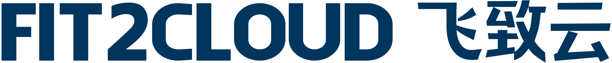

---
# https://vitepress.dev/reference/default-theme-home-page
layout: home

hero:
  name: "2024 中国开源年度报告"
  text: ""
  tagline: 开源社联合多家单位，纵横近十年对中国开源行业的综合性报告，每年发布一次
  actions:
    - theme: brand
      text: 立即阅读 2024 年度报告
      link: /preface
    - theme: alt
      text: 往年报告
      link: https://kaiyuanshe.feishu.cn/wiki/wikcnUDeVll6PNzw900yPV71Sxd

features:
  - icon:
      src: "/image/home/KaiYuanShe-logo.png"
      width: 40
      height: 40
    title: 开源社
    details: 开源社（英文名称为“KAIYUANSHE”）成立于 2014 年，是由志愿贡献于开源事业的个人志愿者，依 “贡献、共识、共治” 原则所组成的开源社区。开源社始终维持 “厂商中立、公益、非营利” 的理念，以 “立足中国、贡献全球，推动开源成为新时代的生活方式” 为愿景，以 “开源治理、国际接轨、社区发展、项目孵化” 为使命，旨在共创健康可持续发展的开源生态体系。
    link: https://kaiyuanshe.cn/
    linkText: 官网
  - icon:
      src: "/image/home/x_lab2017_logo.jpg"
      width: 40
      height: 40
    title: X-lab 开放实验室
    details: X-lab 开放实验室定位为一个开源研究与创新的开放群体，是一群由来自国内外著名高校、创业公司、部分互联网与IT企业的专家学者与工程师所构成，聚焦于开源软件产业开放式创新的共同体。专业背景包括计算机科学、软件工程、数据科学、工商管理学、社会学、经济学等跨学科领域，长期思考并实践开源战略、开源测量学、开源数字生态系统等主题。目前已在包括开源治理标准制定、开源社区行为度量与分析、开源社区流程自动化、开源全域数据治理与洞察等方面做出了较有影响力的工作。
    link: https://github.com/X-lab2017
    linkText: GitHub 链接
---

<VPTeamPage>
  <VPTeamPageTitle>
    <template #title>编写团队</template>
  </VPTeamPageTitle>

  <VPTeamPageSection v-if="convener">
    <template #title>召集人</template>
    <template #members>
      <VPTeamMembers size="small" :members="convener" />
    </template>
  </VPTeamPageSection>

  <VPTeamPageSection v-if="forewordMembers">
    <template #title>卷首语</template>
    <template #members>
      <VPTeamMembers size="small" :members="forewordMembers" />
    </template>
  </VPTeamPageSection>

  <VPTeamPageSection v-if="questionnaireDesignMembers">
    <template #title>问卷篇</template>
    <template #members>
      <VPTeamMembers size="small" :members="questionnaireDesignMembers" />
    </template>
  </VPTeamPageSection>

  <VPTeamPageSection v-if="dataPieceMembers">
    <template #title>数据篇</template>
    <template #members>
      <VPTeamMembers size="small" :members="dataPieceMembers" />
    </template>
  </VPTeamPageSection>

  <VPTeamPageSection v-if="commercializationMembers">
    <template #title>商业化篇</template>
    <template #members>
      <VPTeamMembers size="small" :members="commercializationMembers" />
    </template>
  </VPTeamPageSection>

  <VPTeamPageSection v-if="aiMembers">
    <template #title>开源人工智能篇</template>
    <template #members>
      <VPTeamMembers size="small" :members="aiMembers" />
    </template>
  </VPTeamPageSection>

  <VPTeamPageSection v-if="memorabiliaMembers">
    <template #title>开源大事记</template>
    <template #members>
      <VPTeamMembers size="small" :members="memorabiliaMembers" />
    </template>
  </VPTeamPageSection>

  <VPTeamPageSection v-if="copyreaders">
    <template #title>整体报告汇总/编辑</template>
    <template #members>
      <VPTeamMembers size="small" :members="copyreaders" />
    </template>
  </VPTeamPageSection>

  <VPTeamPageSection v-if="infrastructureMembers">
    <template #title>基础设施支持</template>
    <template #members>
      <VPTeamMembers size="small" :members="infrastructureMembers" />
    </template>
  </VPTeamPageSection>

  <!-- <VPTeamPageSection v-if="artWorkers">
    <template #title>设计/排版</template>
    <template #members>
      <VPTeamMembers size="small" :members="artWorkers" />
    </template>
  </VPTeamPageSection> -->
</VPTeamPage>

<!-- <VPTeamPageTitle>
  <template #title>点评专家</template>
  <template #lead>
    （按姓氏字母顺序列名）
  </template>
</VPTeamPageTitle>

郭雪、姜宁、蒋涛、tison、卫剑钒、余杰
 -->

<VPTeamPageTitle>
  <template #title>协作开源社区/单位</template>
</VPTeamPageTitle>

  
  
  
  
  

<VPTeamPageTitle>
  <template #title>合作媒体</template>
</VPTeamPageTitle>

  
  

